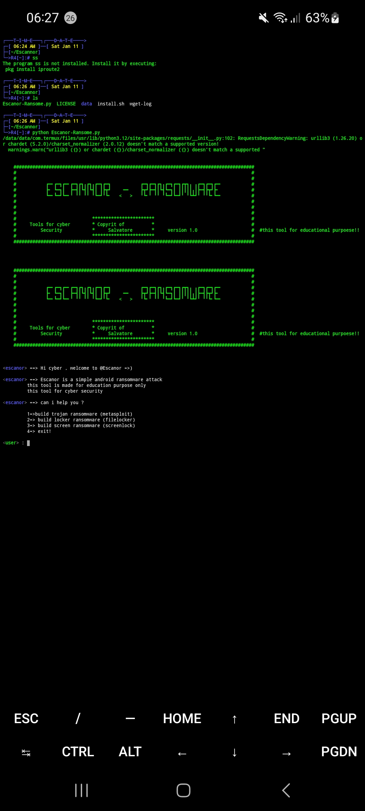

### About
Escannor is a simple tool to create Trojan or Ransomware for Android devices
### Disclaimer
This tool create for cyber  made for education purpose only, the author is not responsible for any loses or damage caused by this programs
### Installation
* Kali Linux, Ubuntu, Debian, Termux (proot-distro: Ubuntu)
```bash
git clone https://github.com/Salvatore00cyber/Escannor.git && cd Escannor && sudo bash install.sh && python3 Escanor-Ransome.py
```

# 🎫 Coding Services SEND DM 🎫


